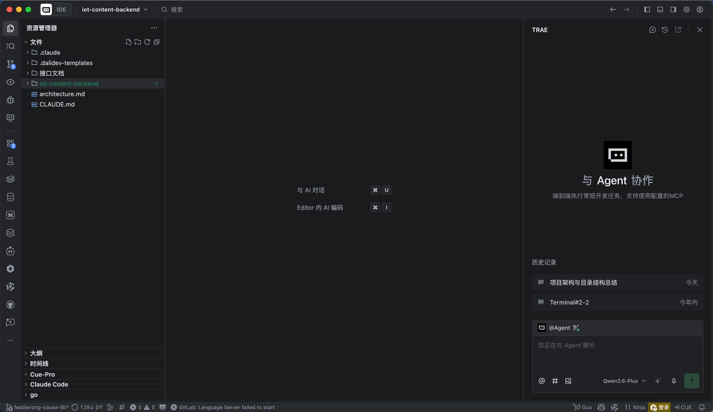
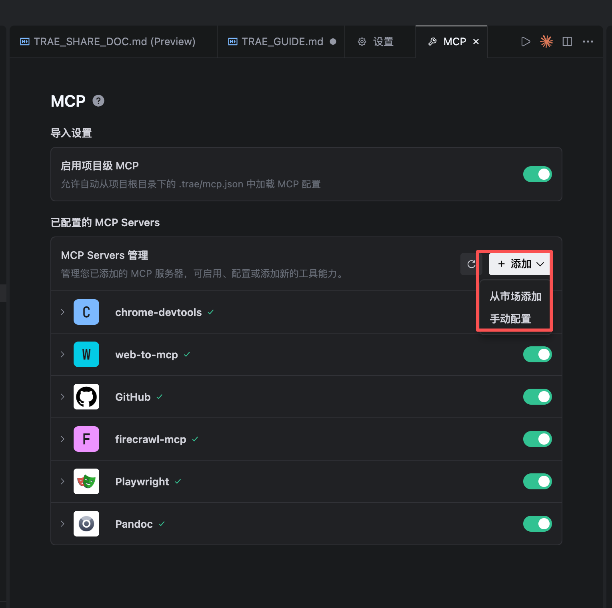
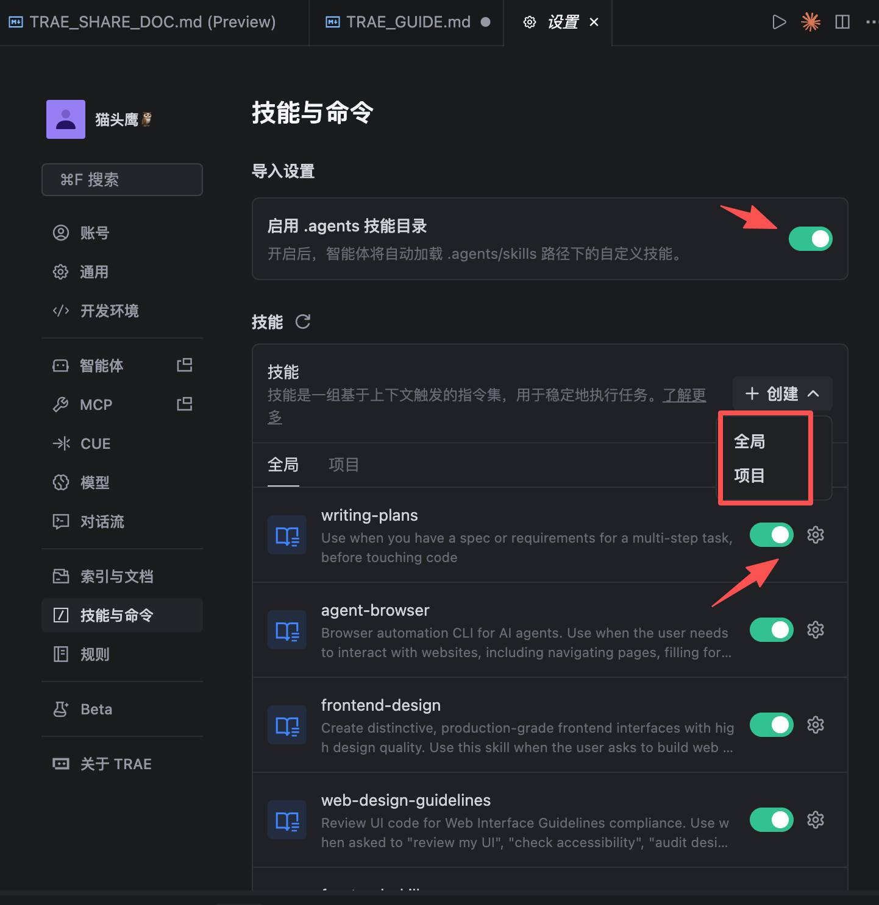
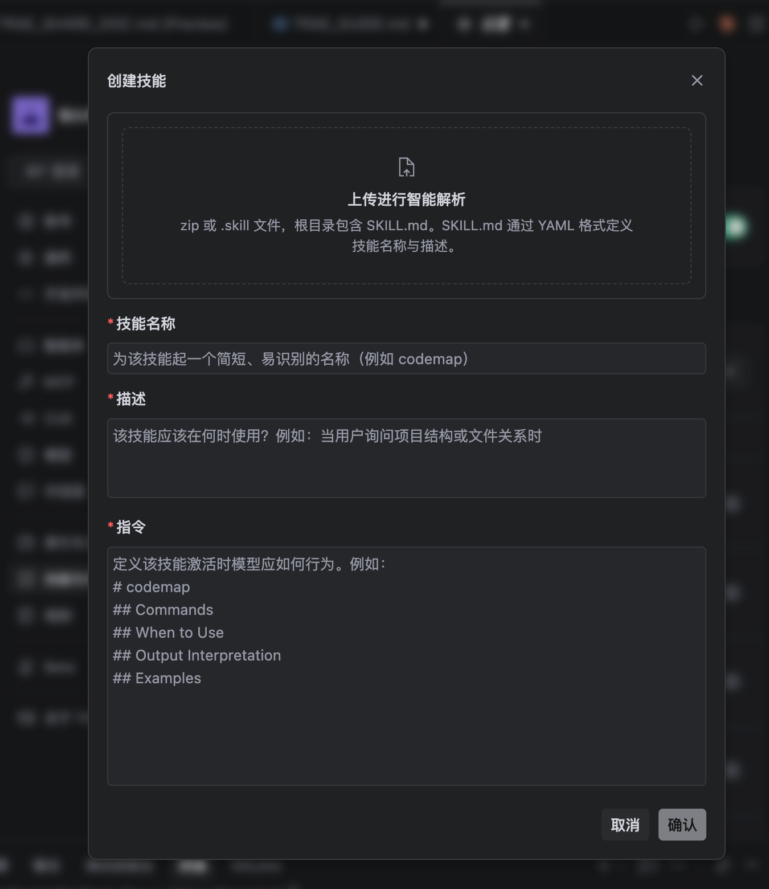
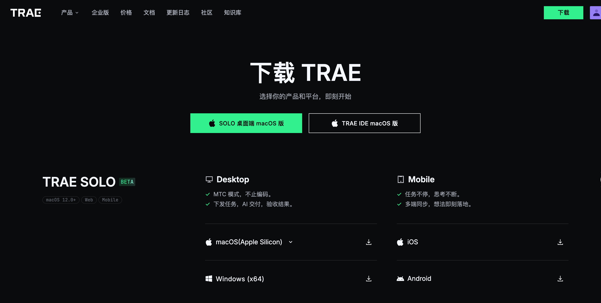

# Trae 功能介绍与使用指南

***

## 目录

1. [概述](#概述)
   - [IDE集成模式](#ide集成模式)
   - [Trae SOLO独立模式](#trae-solo独立模式)
   - [插件模式](#插件模式)
   - [CLI命令行模式](#cli命令行模式)
2. [IDE集成模式详解](#ide集成模式详解)
   - [MCP（模型控制平台）功能](#mcp模型控制平台功能)
   - [Skill技能系统](#skill技能系统)
   - [模型选择与配置](#模型选择与配置)
   - [插件安装与管理](#插件安装与管理)
3. [Trae SOLO模式专项介绍](#trae-solo模式专项介绍)
   - [桌面端安装与配置](#桌面端安装与配置)
   - [手机端下载与使用](#手机端下载与使用)
   - [功能差异与数据同步](#功能差异与数据同步)
4. [实践案例](#实践案例)
   - [IDE集成模式案例](#ide集成模式案例)
   - [Trae SOLO模式案例](#trae-solo模式案例)
5. [参考资源](#参考资源)

***

## 概述

Trae 是一款强大的AI助手工具，支持多种使用模式以满足不同场景需求。以下是四种核心模式的介绍：

### IDE集成模式

**基本概念**：将Trae无缝集成到主流IDE（如VS Code、Cursor等）中，在编码过程中提供智能化辅助。

**适用场景**：

- 日常代码编写、调试
- 代码重构与优化
- 实时代码解释与文档生成

**主要特点**：

- 与代码编辑器深度集成
- 支持上下文感知的代码补全
- 可直接调用技能工具处理代码任务

**界面入口**：

***

### Trae SOLO独立模式

**基本概念**：独立运行的桌面或移动端应用，无需依赖IDE环境。

**适用场景**：

- 非开发人员使用AI能力
- 快速文档编写与整理
- 移动端随时随地使用

**主要特点**：

- 轻量级独立应用
- 支持多平台（Windows、macOS、iOS、Android）
- 数据云端同步

**界面预览**：

***

### 插件模式

**基本概念**：通过插件扩展Trae功能，支持自定义工具和工作流。

**适用场景**：

- 团队定制化需求
- 特定业务场景扩展
- 第三方工具集成

**主要特点**：

- 模块化设计
- 支持社区插件
- 灵活的扩展机制

***

### CLI命令行模式

**基本概念**：通过命令行接口使用Trae的核心功能。

**适用场景**：

- 自动化脚本集成
- 服务器环境使用
- CI/CD流程集成

**主要特点**：

- 轻量级无界面
- 支持脚本调用
- 适合自动化场景

***

## IDE集成模式详解

### MCP（模型控制平台）功能

MCP 是 Trae 的模型管理核心，让您可以灵活配置和切换不同的AI模型。

**操作步骤**：

1. **打开MCP面板**
   - 在右上角点击 头像->设置图标，选择「MCP」
   - 可以手动配置，也可以通过市场添加MCP服务

**界面截图**：

***

### Skill技能系统

Skill 是 Trae 的核心能力扩展系统，通过调用不同的技能完成特定任务。

**操作步骤**：

1. **打开技能面板**
   - 在右上角点击 头像->设置图标，选择「规则与技能」
   - 显示已安装的技能列表
2. **添加技能**
   - 可以手动添加项目技能或全局技能
   - 项目的技能可以应用到全局技能中
3. **调用技能**
   - 在对话框中输入 `/` 触发技能提示
4. **管理技能**
   - 打开技能开关，即可调用已安装的技能
   - 可以在技能列表中查看、编辑、禁用或删除技能

**界面截图**：

***

### 插件安装与管理

**操作步骤**：

1. **打开插件市场**
   - 使用快捷键 `Ctrl+Shift+X`（Windows）/ `Cmd+Shift+X`（Mac）
   - 或点击侧边栏「Extensions」图标
2. **搜索Trae插件**
   - 在搜索框输入「Trae」
   - 显示相关插件列表
3. **安装插件**
   - 找到目标插件点击「Install」
   - 等待安装完成
4. **管理插件**
   - 已安装插件显示「Uninstall」按钮
   - 可随时卸载不需要的插件

**界面截图**：

***

## Trae SOLO模式专项介绍

### 桌面端安装与配置

**安装步骤**：

1. **下载安装包**
   - 访问官方下载页面
   - 选择对应操作系统版本（Windows/macOS）
2. **运行安装程序**
   - Windows：双击 `.exe` 文件
   - macOS：双击 `.dmg` 文件并拖拽到应用程序文件夹
3. **首次启动**
   - 打开应用程序
   - 显示欢迎界面
4. **登录账户**
   - 输入账号密码或使用扫码登录
   - 登录成功后进入主界面

**界面截图**：

**下载地址：** <https://www.trae.cn/ide/download>

***

### 手机端下载与使用

**下载步骤**：

1. **打开应用商店**
   - iOS：打开「App Store」
   - Android：打开「应用商店」或其他应用市场
2. **搜索应用**
   - 输入「Trae」
   - 找到官方应用
3. **下载安装**
   - 点击「获取」或「安装」
   - 等待下载完成

**界面截图**：

**基本操作**：

1. **启动应用**
   - 点击桌面图标打开
   - 首次使用需登录
2. **使用聊天功能**
   - 在输入框输入问题
   - 点击发送按钮
3. **切换功能模块**
   - 底部导航栏切换不同功能
   - 包括聊天、技能、上传附件、切换云端和本地电脑、语音讨论、语音输入等

***

### 功能差异与数据同步

**桌面端 vs 手机端功能对比**：

| 功能    | 桌面端    | 手机端      |
| ----- | ------ | -------- |
| 代码编辑  | ✅ 支持   | ⚠️ 有限支持  |
| 技能调用  | ✅ 完整支持 | ✅ 支持常用技能 |
| 文件管理  | ✅ 完整支持 | ⚠️ 有限支持  |
| 多任务处理 | ✅ 支持   | ❌ 不支持    |
| 快捷键   | ✅ 丰富   | ⚠️ 有限    |

**数据同步说明**：

1. **自动同步机制**
   - 所有数据存储在云端
   - 登录同一账号自动同步
2. **同步内容**
   - 聊天记录
   - 技能配置
   - 用户偏好设置
   - 文件上传记录
3. **离线模式**
   - 支持离线查看历史记录
   - 联网后自动同步

***

## 实践案例

### IDE集成模式案例

#### 案例一：代码审查与优化

**标题占位符**：【案例一】使用Trae进行代码审查

**内容提示**：

- 场景描述：团队成员提交代码后，使用Trae进行自动化代码审查
- 操作步骤：
  1. 打开待审查的代码文件
  2. 调用 `code-review` 技能
  3. 查看审查报告
  4. 根据建议进行优化
- 预期效果：提高代码质量，减少潜在bug

***

#### 案例二：文档自动生成

**标题占位符**：【案例二】自动生成API文档

**内容提示**：

- 场景描述：根据代码注释自动生成API文档
- 操作步骤：
  1. 编写带有规范注释的代码
  2. 调用文档生成技能
  3. 预览并导出文档
- 预期效果：减少文档编写时间，保持文档与代码同步

***

### Trae SOLO模式案例

#### 案例一：会议纪要整理

**标题占位符**：【案例一】使用Trae SOLO整理会议纪要

**内容提示**：

- 场景描述：会议结束后，使用Trae快速整理会议纪要
- 操作步骤：
  1. 上传会议录音或输入会议要点
  2. 调用纪要整理技能
  3. 编辑完善生成的纪要
  4. 分享给团队成员
- 预期效果：提高会议效率，确保信息准确传递

***

#### 案例二：知识问答与学习

**标题占位符**：【案例二】利用Trae进行知识学习

**内容提示**：

- 场景描述：团队成员利用Trae学习新技术、解决问题
- 操作步骤：
  1. 输入学习问题或技术难点
  2. 获取详细解答
  3. 保存学习笔记
  4. 分享学习心得
- 预期效果：促进知识共享，提升团队技术水平

***

## 参考资源

### 官方文档

- [Trae官方知识库](https://lcnziv86vkx6.feishu.cn/wiki/ETu0wpP7zi2TgBkVVoFc2OtJnqd?from=from_copylink)
- [Trae官方文档](https://docs.trae.cn/ide/what-is-trae?_lang=zh)

   

