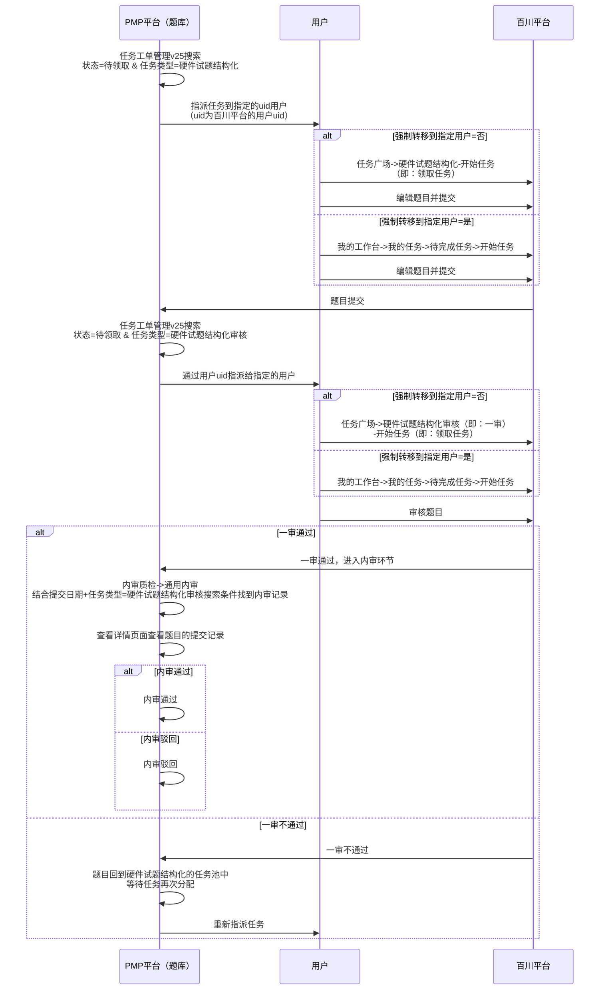

# 百川平台与题库交互-时序图

```mermaid
sequenceDiagram
    participant PMP as PMP平台（题库）
    participant User as 用户
    participant Baichuan as 百川平台
    
    %% 步骤1：PMP平台搜索待领取任务
    PMP->>PMP: 任务工单管理v25搜索<br/>状态=待领取 & 任务类型=硬件试题结构化
    
    %% 步骤2：指派任务到指定用户
    PMP->>User: 指派任务到指定的uid用户<br/>（uid为百川平台的用户uid）
    
    %% 步骤3：用户编辑题目并提交（两种情况）
    alt 强制转移到指定用户=否
        User->>Baichuan: 任务广场->硬件试题结构化-开始任务<br/>（即：领取任务）
        User->>Baichuan: 编辑题目并提交
    else 强制转移到指定用户=是
        User->>Baichuan: 我的工作台->我的任务->待完成任务->开始任务
        User->>Baichuan: 编辑题目并提交
    end
    
    %% 步骤4：提交后，PMP平台搜索待领取的审核任务
    Baichuan->>PMP: 题目提交
    PMP->>PMP: 任务工单管理v25搜索<br/>状态=待领取 & 任务类型=硬件试题结构化审核
    PMP->>User: 通过用户uid指派给指定的用户
    
    %% 步骤5：审核任务（一审）
    alt 强制转移到指定用户=否
        User->>Baichuan: 任务广场->硬件试题结构化审核（即：一审）<br/>-开始任务（即：领取任务）
    else 强制转移到指定用户=是
        User->>Baichuan: 我的工作台->我的任务->待完成任务->开始任务
    end
    User->>Baichuan: 审核题目
    
    %% 步骤5.1：一审结果
    alt 一审通过
        Baichuan->>PMP: 一审通过，进入内审环节
        %% 步骤6：内审质检
        PMP->>PMP: 内审质检->通用内审<br/>结合提交日期+任务类型=硬件试题结构化审核搜索条件找到内审记录
        PMP->>PMP: 查看详情页面查看题目的提交记录
        
        alt 内审通过
            PMP->>PMP: 内审通过
        else 内审驳回
            PMP->>PMP: 内审驳回
        end
    else 一审不通过
        Baichuan->>PMP: 一审不通过
        PMP->>PMP: 题目回到硬件试题结构化的任务池中<br/>等待任务再次分配
        PMP->>User: 重新指派任务
    end
```