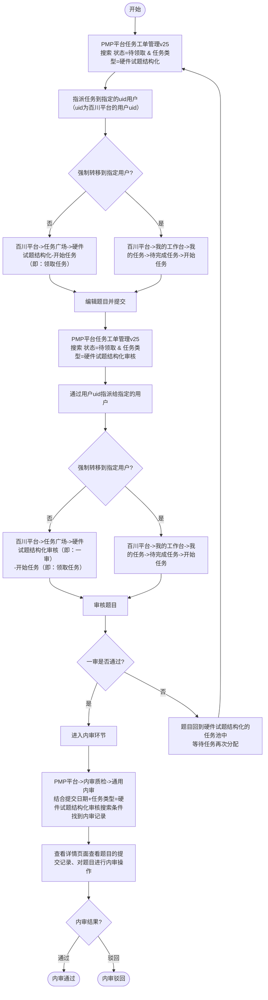

# 百川平台与题库交互-流程图

```mermaid
flowchart TD
    Start([开始]) --> A[PMP平台任务工单管理v25<br/>搜索 状态=待领取 & 任务类型=硬件试题结构化]
    A --> B[指派任务到指定的uid用户<br/>（uid为百川平台的用户uid）]
    
    B --> C{强制转移到指定用户?}
    
    C -- 否 --> D[百川平台->任务广场->硬件试题结构化-开始任务<br/>（即：领取任务）]
    D --> E[编辑题目并提交]
    
    C -- 是 --> F[百川平台->我的工作台->我的任务->待完成任务->开始任务]
    F --> E
    
    E --> G[PMP平台任务工单管理v25<br/>搜索 状态=待领取 & 任务类型=硬件试题结构化审核]
    G --> H[通过用户uid指派给指定的用户]
    
    H --> I{强制转移到指定用户?}
    
    I -- 否 --> J[百川平台->任务广场->硬件试题结构化审核（即：一审）<br/>-开始任务（即：领取任务）]
    I -- 是 --> K[百川平台->我的工作台->我的任务->待完成任务->开始任务]
    
    J --> L[审核题目]
    K --> L
    
    L --> M{一审是否通过?}
    
    M -- 是 --> N[进入内审环节]
    N --> O[PMP平台->内审质检->通用内审<br/>结合提交日期+任务类型=硬件试题结构化审核搜索条件找到内审记录]
    O --> P[查看详情页面查看题目的提交记录、对题目进行内审操作]
    P --> Q{内审结果?}
    Q -- 通过 --> R([内审通过])
    Q -- 驳回 --> S([内审驳回])
    
    M -- 否 --> T[题目回到硬件试题结构化的任务池中<br/>等待任务再次分配]
    T --> A
```