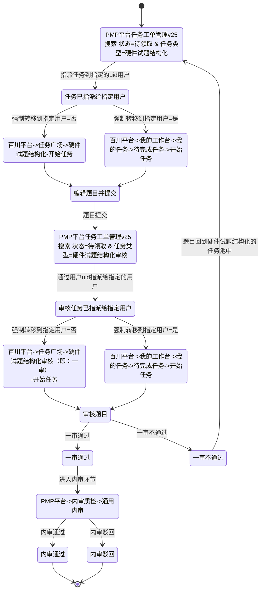

# 百川平台与题库交互-状态图

```mermaid
stateDiagram-v2
    [*] --> PMP搜索待领取任务
    
    state "PMP平台任务工单管理v25<br/>搜索 状态=待领取 & 任务类型=硬件试题结构化" as PMP搜索待领取任务
    state "任务已指派给指定用户" as 任务已指派
    state "百川平台->任务广场->硬件试题结构化-开始任务" as 百川广场领取任务
    state "百川平台->我的工作台->我的任务->待完成任务->开始任务" as 百川工作台领取任务
    state "编辑题目并提交" as 编辑提交
    state "PMP平台任务工单管理v25<br/>搜索 状态=待领取 & 任务类型=硬件试题结构化审核" as PMP搜索审核任务
    state "审核任务已指派给指定用户" as 审核任务已指派
    state "百川平台->任务广场->硬件试题结构化审核（即：一审）<br/>-开始任务" as 百川广场审核任务
    state "百川平台->我的工作台->我的任务->待完成任务->开始任务" as 百川工作台审核任务
    state "审核题目" as 审核题目
    state "一审通过" as 一审通过
    state "一审不通过" as 一审不通过
    state "PMP平台->内审质检->通用内审" as 内审质检
    state "内审通过" as 内审通过
    state "内审驳回" as 内审驳回
    
    PMP搜索待领取任务 --> 任务已指派 : 指派任务到指定的uid用户
    
    任务已指派 --> 百川广场领取任务 : 强制转移到指定用户=否
    任务已指派 --> 百川工作台领取任务 : 强制转移到指定用户=是
    
    百川广场领取任务 --> 编辑提交
    百川工作台领取任务 --> 编辑提交
    
    编辑提交 --> PMP搜索审核任务 : 题目提交
    
    PMP搜索审核任务 --> 审核任务已指派 : 通过用户uid指派给指定的用户
    
    审核任务已指派 --> 百川广场审核任务 : 强制转移到指定用户=否
    审核任务已指派 --> 百川工作台审核任务 : 强制转移到指定用户=是
    
    百川广场审核任务 --> 审核题目
    百川工作台审核任务 --> 审核题目
    
    审核题目 --> 一审通过 : 一审通过
    审核题目 --> 一审不通过 : 一审不通过
    
    一审通过 --> 内审质检 : 进入内审环节
    一审不通过 --> PMP搜索待领取任务 : 题目回到硬件试题结构化的任务池中
    
    内审质检 --> 内审通过 : 内审通过
    内审质检 --> 内审驳回 : 内审驳回
    
    内审通过 --> [*]
    内审驳回 --> [*]
```