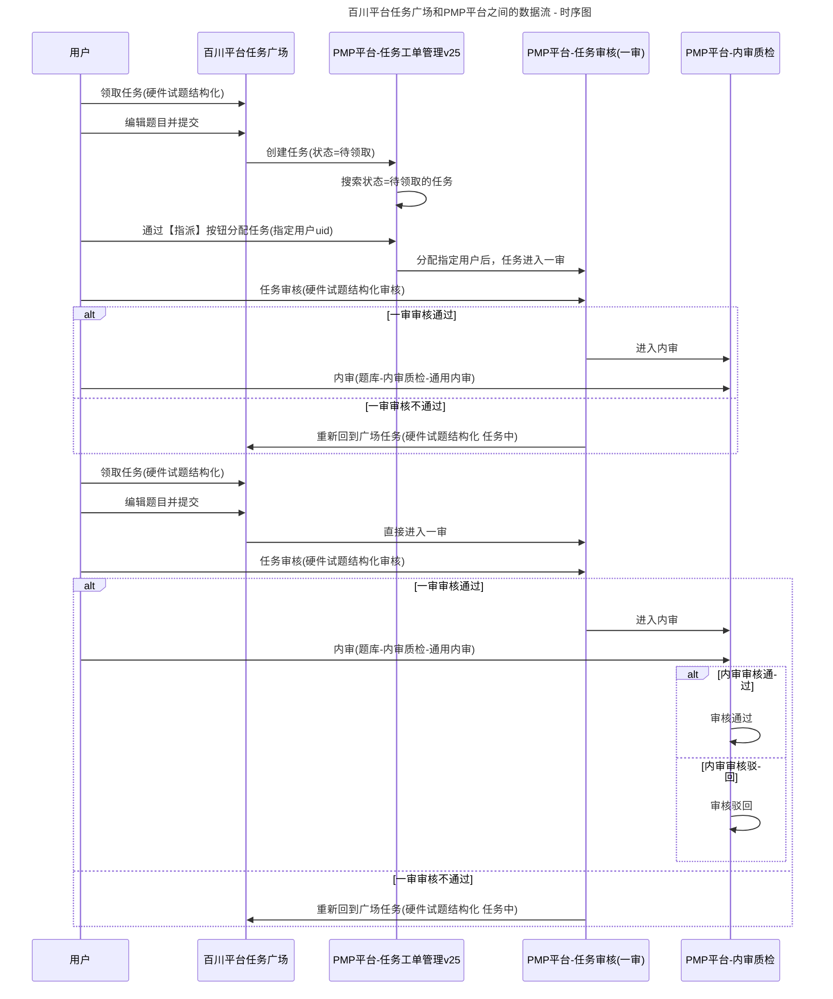

```mermaid
sequenceDiagram
    title 百川平台任务广场和PMP平台之间的数据流 - 时序图
    
    participant User as 用户
    participant Baichuan as 百川平台任务广场
    participant PMP_Task as PMP平台-任务工单管理v25
    participant PMP_Review1 as PMP平台-任务审核(一审)
    participant PMP_Internal as PMP平台-内审质检
    
    %% 流程1：百川广场领取任务 -> PMP任务工单管理 -> 分配用户 -> 一审 -> 内审
    User->>Baichuan: 领取任务(硬件试题结构化)
    User->>Baichuan: 编辑题目并提交
    Baichuan->>PMP_Task: 创建任务(状态=待领取)
    PMP_Task->>PMP_Task: 搜索状态=待领取的任务
    User->>PMP_Task: 通过【指派】按钮分配任务(指定用户uid)
    PMP_Task->>PMP_Review1: 分配指定用户后，任务进入一审
    User->>PMP_Review1: 任务审核(硬件试题结构化审核)
    alt 一审审核通过
        PMP_Review1->>PMP_Internal: 进入内审
        User->>PMP_Internal: 内审(题库-内审质检-通用内审)
    else 一审审核不通过
        PMP_Review1->>Baichuan: 重新回到广场任务(硬件试题结构化 任务中)
    end
    
    %% 流程2：百川广场领取任务 -> 一审 -> 内审
    User->>Baichuan: 领取任务(硬件试题结构化)
    User->>Baichuan: 编辑题目并提交
    Baichuan->>PMP_Review1: 直接进入一审
    User->>PMP_Review1: 任务审核(硬件试题结构化审核)
    alt 一审审核通过
        PMP_Review1->>PMP_Internal: 进入内审
        User->>PMP_Internal: 内审(题库-内审质检-通用内审)
        alt 内审审核通过
            PMP_Internal->>PMP_Internal: 审核通过
        else 内审审核驳回
            PMP_Internal->>PMP_Internal: 审核驳回
        end
    else 一审审核不通过
        PMP_Review1->>Baichuan: 重新回到广场任务(硬件试题结构化 任务中)
    end

```